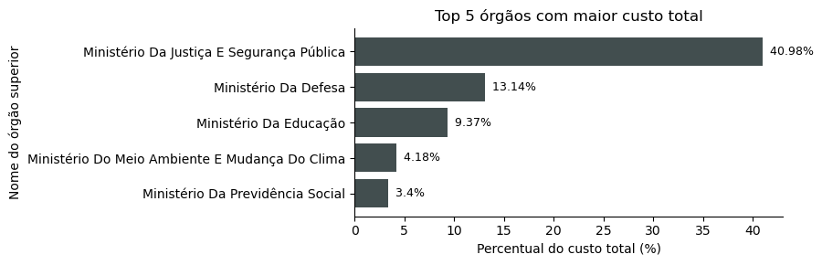
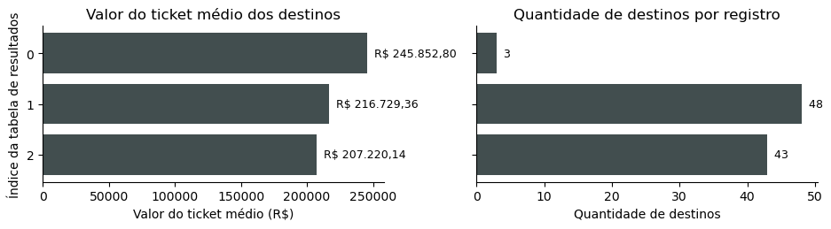
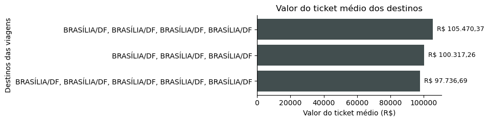
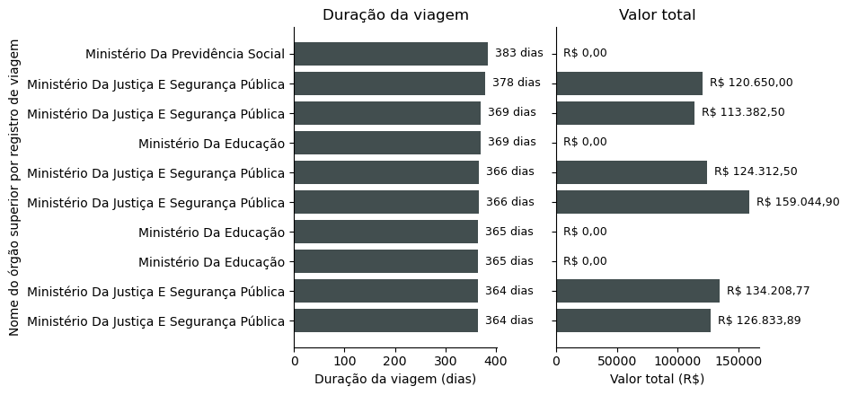
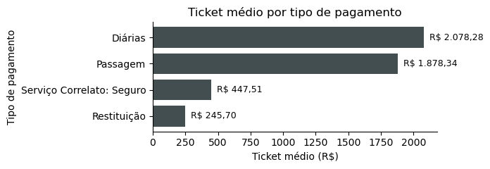
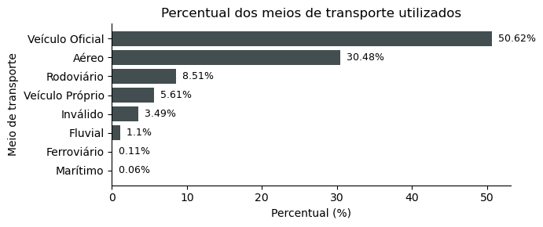
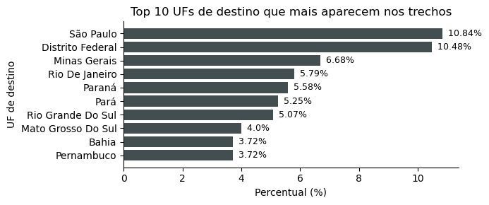
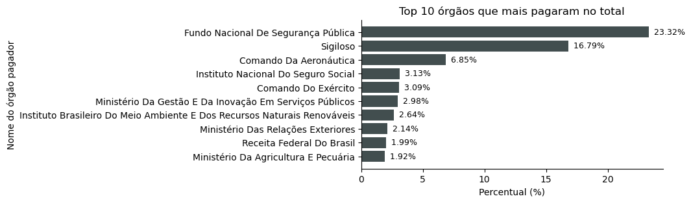

# transparencia_analysis
Neste repositório consta a análise de dados do dataset de viagens extraído do Portal da Transparência como 2ª projeto avaliativo do módulo 1 do curso de análise de dados do SCTEC.
Trata-se, basicamente, da implementação de um pipeline completo que consiste na construção do banco de dados, extração, transformação e carga dos respectivos registros e posterior análise e resposta das perguntas de negócio propostas.

### Objetivo
Busca-se executar a análise e considerações à cerca das questões presentes no documento de instrução `./assets/briefing.pdf`.

Deve-se implementar um pipeline de dados (ETL) para a construção do banco, extração, transformação e carga dos registros, sob a ótica das boas práticas de programação e organização.

Na sequência, realiza-se a devida análise dos dados presentes para resolução das questões de negócio, acompanhada de gráficos e visualizações.
As 7 perguntas de negócio à serem respondidas são:

- Os 5 órgãos com maior custo total?
- Os 3 destinos com maior custo médio por viagem?
- A viagem de maior duração e seu custo total?
- Qual o tipo de pagamento com maior valor médio?
- Qual o meio de transporte mais usado nos trechos?
- Qual UF de destino aparece em mais trechos?
- Qual órgão pagou mais no total?

Por fim, pretende-se formular considerações e conclusões finais à cerca do projeto.

### Metodologia
Neste projeto foi empregado o banco de dados MySQL, com o auxílio da ferramenta gráfica 'MySQL Workbench', além de também a linguagem de programação 'Python' e as respectivas bibliotecas: 'pandas', 'matplotlib', 'mysql-connector-python', 'notebook' e 'gdown'.
Ademais, o sistema de versionamento 'git' é utilizado para o gerenciamento e organização temporal da base de código do projeto.

A pipeline construída segue a lógica 'Extract, Transform, Load' (ETL), ditando uma ordem específica nas operações a serem executadas sobre os dados ao longo do projeto.
Concomitantemente, a arquitetura de armazenamento e gerenciamento destes dados no banco segue a lógica 'medalhão', composta por camadas sucessivamente mais refinadas que dão suporte à analise ('raw', 'silver' e 'gold').
Na camada 'raw' todos os atributos de todas as tabelas são do tipo 'varchar' para manter a integridade total dos dados brutos na origem.
Na camada 'silver' já estão presentes decisões de limpeza de dados, padronização, conversão de tipos para os atributos, definição de restrições e cálculo de atributos adicionais que darão suporte para análises posteriores.
Já a camada 'gold' irá armazenar os dados filtrados e consolidados diretamente das análises efetuadas.

Num primeiro momento, para que seja possível a execução do pipeline desejado, deve-se realizar a criação do banco de dados e das tabelas das camadas 'raw' e 'silver', que abrigarão, respectivamente, os dados brutos e limpos/tipados.
Este procedimento de criação se encontra definido no arquivo `./sql/0_criar_banco.sql`.
Ao todo, são 4 tabelas da camada 'raw' ('raw_viagem', 'raw_trecho', 'raw_pagamento' e 'raw_passagem') e 4 tabelas da camada 'silver' ('silver_viagem', 'silver_trecho', 'silver_pagamento' e 'silver_passagem').
A camada 'gold' e respectivas 'views' são construídas no momento de realização das análises.

Na sequência, realiza-se a etapa de extração dos dados brutos, que são baixados diretamente do diretório do google drive disponibilizado, extraídos e automaticamente inseridos nas suas respectivas tabelas da camada 'raw' do banco.
A implementação das rotinas desta etapa está definida no arquivo `./scripts/1_extrair.py`.

A etapa de transformação trata de realizar a limpeza, padronização, conversão dos tipos dos atributos, cálculo dos atributos adicionais e posterior inserção dos registros na camada 'silver' do banco.
A implementação das rotinas desta etapa está definida no arquivo `./scripts/2_transformar.py`.

Por fim, as questões propostas pelo documento de instrução são respondidas e discutidas na etapa de análise definida no arquivo `./scripts/3_analise.ipynb`.
Nesta etapa são criadas e definidas tabelas e 'views' da camada 'gold', agregando e consolidando os dados de interesse para dar suporte à análise pretendida.
Cada uma das questões analisadas irá dar origem à uma tabela, uma view e um gráfico correspondente para visualização.

### Requisitos
Este repositório faz uso das seguintes bibliotecas:

- pandas
- matplotlib
- notebook
- mysql-connector-python
- gdown

Por favor, instale-as previamente.
O processo por ser feito individualmente ou por meio do gerenciador de pacotes `pip` à partir da pasta raiz do projeto:
```bash
pip install -r requirements.txt
```

### Organização do projeto
Este projeto é composto pelos seguintes arquivos e ficheiros:

- `./.git`: Foi utilizado git para versionamento e controle durante a realização do projeto.
- `./.gitignore`: Arquivo pertencente ao processo do `git`. Nele estão os padrões a serem ignorados durante o versionamento.
- `./scripts/`: Nesta pasta estão os arquivos da pipeline e análise do projeto (`./scripts/1_extrair.py`, `./scripts/2_transformar.py`, `./scripts/3_analise.ipynb`).
- `./sql/`: Nesta pasta estão os arquivos de construção do banco de dados e das respectivas tabelas das camadas 'raw' e 'silver'.
- `./assets/`: Nesta pasta estão os demais arquivos empregados, tais como o descritivo da atividade prática.
- `./data/`: Nesta pasta se encontram os dados brutos de viagens analisados pelo projeto.
- `./README.md`: Este arquivo descritivo do projeto.
- `./requirements.txt`: Arquivo que contém as dependências necessárias para a correta execução do projeto.
- `./.env.example`: Arquivo exemplo com as variáveis de ambiente para a correta execução do projeto. O formato final do nome do arquivo deve ser `.env`.

### Uso
O projeto possui uma lógica de execução linear, cuja correta execução das etapas segue:

`0_criar_banco.sql` → `1_extrair.py` → `2_transformar.py` → `3_analise.ipynb`.

A execução de `0_criar_banco.sql` pode ser realizada por meio da interface do 'MySQL Workbench' com as devidas permissões e credenciais.

A execução dos scripts em python pode ser realizada à partir da pasta `./scripts/` ou da pasta raiz do projeto com a devida ativação do ambiente 'Python' correto (que possua os requisitos de bibliotecas atendidos).
Adicionalmente é possível invocar os referidos scripts por meio do interpretador 'Python' correto (do ambiente que atenda aos requisitos do projeto), tanto da pasta raiz quanto da pasta `./scripts/`.

Por fim, o arquivo `3_analise.ipynb` deve ser executado por meio do interpretador 'jupyter-notebook', que se encontra na mesma pasta de binários que o interpretador 'Python' do ambiente.

Como exemplo, pode-se consultar o arquivo `./scripts/run.sh`, em que a variável `$PYTHON_ENV` deve apontar para a pasta raiz do ambiente 'Python' correto.

### Resultados

Como um dos resultados do projeto, tem-se a implementação de uma pipeline completo (ETL) para extração, limpeza, padronização e carga de dados do portal da transparência sobre viagens para um banco de dados em MySQL, seguindo a arquitetura medalhão.

Adicionalmente, obtém-se um conjunto de resultados e considerações das análises realizadas em `./scripts/3_analise.ipynb`.
À seguir é apresentado o conteúdo do referido script de análise.

<!-- Começo do script de análise './scripts/3_analise.ipynb' -->

```python
import pandas as pd
import matplotlib.pyplot as plt
from matplotlib.colors import ListedColormap

from common import banco
from common.config import MY_PALETTE, MY_COLORS

import warnings

warnings.filterwarnings("ignore", category=UserWarning)


def reais(valor):
    """Formata um número como moeda brasileira: 1234.5 -> 'R$ 1.234,50'."""
    texto = f"{valor:,.2f}"
    return "R$ " + texto.replace(",", "X").replace(".", ",").replace("X", ".")


def print_nulos_por_col(df):
    print("Nulos por coluna:")
    nulos = df.isnull().sum()
    pct = (nulos / len(df) * 100).round(1)
    for col in df.columns:
        if nulos[col] > 0:
            print(f"  {col}: {nulos[col]} ({pct[col]}%)")
    print()


def relatorio_df(df, descricao):
    # Criação do relatório de qualidade
    def relatorio_qualidade(df, nome):
        print(f"\n{'=' * 50}")
        print(f"RELATÓRIO: {nome}".center(50))
        print(f"{'=' * 50}")
        print(f"Linhas: {df.shape[0]} | Colunas: {df.shape[1]}")
        print()
        print_nulos_por_col(df)
        n_duplicatas = df.duplicated().sum()
        print(f"Duplicatas: {n_duplicatas} ({n_duplicatas / len(df) * 100:.2f}%)")
        print()
        print("Tipos das colunas:")
        print(df.dtypes)

    relatorio_qualidade(df, descricao)
    print()

```

Primeiro, é interessante saber o quão confiáveis estes dados são.
Para tanto, à seguir é realizada uma análise de qualidade dos dados presentes nas 4 tabelas da camada silver que já foram padronizados e tipados em etapa anterior (2_transformar.py).


```python
try:
    conexao = banco.conectar()
    for tabela in ["silver_viagem", "silver_passagem", "silver_trecho", "silver_pagamento"]:
        q = pd.read_sql(f"select * from {tabela};", conexao)
        relatorio_df(q, f"Transparẽncia - {tabela}")
except BaseException as erro:
    print(f"Ocorreu a seguinte exceção: {erro}")
finally:
    conexao.close()
```

    
    ==================================================
         RELATÓRIO: Transparẽncia - silver_viagem     
    ==================================================
    Linhas: 341860 | Colunas: 18
    
    Nulos por coluna:
      cargo: 127931 (37.4%)
      motivo: 1 (0.0%)
    
    Duplicatas: 0 (0.00%)
    
    Tipos das colunas:
    id_viagem               object
    num_proposta            object
    situacao                object
    viagem_urgente          object
    cod_orgao_superior      object
    nome_orgao_superior     object
    nome_viajante           object
    cargo                   object
    data_inicio             object
    data_fim                object
    destinos                object
    motivo                  object
    valor_diarias          float64
    valor_passagens        float64
    valor_devolucao        float64
    valor_outros_gastos    float64
    valor_total            float64
    duracao_dias             int64
    dtype: object
    
    
    ==================================================
        RELATÓRIO: Transparẽncia - silver_passagem    
    ==================================================
    Linhas: 167260 | Colunas: 12
    
    Nulos por coluna:
      uf_origem_ida: 5196 (3.1%)
      uf_destino_ida: 6243 (3.7%)
      data_emissao: 664 (0.4%)
    
    Duplicatas: 0 (0.00%)
    
    Tipos das colunas:
    id_passagem             int64
    id_viagem              object
    meio_transporte        object
    pais_origem_ida        object
    uf_origem_ida          object
    cidade_origem_ida      object
    pais_destino_ida       object
    uf_destino_ida         object
    cidade_destino_ida     object
    valor_passagem        float64
    taxa_servico          float64
    data_emissao           object
    dtype: object
    
    
    ==================================================
         RELATÓRIO: Transparẽncia - silver_trecho     
    ==================================================
    Linhas: 763349 | Colunas: 11
    
    Nulos por coluna:
      origem_uf: 14770 (1.9%)
      destino_uf: 14742 (1.9%)
    
    Duplicatas: 0 (0.00%)
    
    Tipos das colunas:
    id_trecho             int64
    id_viagem            object
    sequencia_trecho      int64
    origem_data          object
    origem_uf            object
    origem_cidade        object
    destino_data         object
    destino_uf           object
    destino_cidade       object
    meio_transporte      object
    numero_diarias      float64
    dtype: object
    
    
    ==================================================
       RELATÓRIO: Transparẽncia - silver_pagamento    
    ==================================================
    Linhas: 606916 | Colunas: 7
    
    Nulos por coluna:
    
    Duplicatas: 0 (0.00%)
    
    Tipos das colunas:
    id_pagamento            int64
    id_viagem              object
    num_proposta           object
    nome_orgao_pagador     object
    nome_ug_pagadora       object
    tipo_pagamento         object
    valor                 float64
    dtype: object
    


Percebe-se que nenhuma das tabelas registraram valores duplicados. Adicionalmente, com a exceção da tabela 'silver_viagem' (para o atributo 'cargo' com 37,4%), todas as outras possuem colunas com números insignificantes de valores nulos (no máximo de 3,7% em silver_passagem). Entende-se que, portanto, é possível sim fazer uso de todas as colunas (tomando o cuidado de desconsiderar o atributo 'cargo' de 'silver_viagem') sem prejuízo no resultado da análise.

Na sequência, as seguintes perguntas de negócio são respondidas:

- Os 5 órgãos com maior custo total?
- Os 3 destinos com maior custo médio por viagem?
- A viagem de maior duração e seu custo total?
- Qual o tipo de pagamento com maior valor médio?
- Qual o meio de transporte mais usado nos trechos?
- Qual UF de destino aparece em mais trechos?
- Qual órgão pagou mais no total?


```python
"Os 5 órgãos com maior custo total?"

try:
    conexao = banco.conectar()

    banco.executar(conexao, "DROP TABLE IF EXISTS gold_top_orgaos_custo_total;")
    banco.executar(conexao, "DROP VIEW IF EXISTS vw_gold_top_orgaos_custo_total;")

    banco.executar(
    conexao,
    """
    CREATE TABLE gold_top_orgaos_custo_total AS
    SELECT nome_orgao_superior, SUM(valor_total) as custo_total, ROUND(100 * SUM(valor_total) / (SELECT SUM(valor_total) FROM silver_viagem), 2) as pct
    FROM silver_viagem
    GROUP BY nome_orgao_superior;
    """
    )
    banco.executar(
    conexao,
    """
    CREATE VIEW vw_gold_top_orgaos_custo_total AS
    SELECT nome_orgao_superior, SUM(valor_total) as custo_total, ROUND(100 * SUM(valor_total) / (SELECT SUM(valor_total) FROM silver_viagem), 2) as pct
    FROM silver_viagem
    GROUP BY nome_orgao_superior;
    """
    )
    
    q1 = pd.read_sql("SELECT * FROM gold_top_orgaos_custo_total ORDER BY custo_total DESC LIMIT 5;", conexao)

    q1["nome_orgao_superior"] = q1["nome_orgao_superior"].str.title()
    print("Top 5 órgãos com maior custo total")
    print(q1.to_string(float_format=lambda f: str(f)))
    print()

    base_color = MY_COLORS["base"]
    fig, ax = plt.subplots(figsize=(9,3))
    ax.barh(q1["nome_orgao_superior"], q1["pct"], color=base_color)
    ax.invert_yaxis()  # maior em cima
    ax.set_title("Top 5 órgãos com maior custo total")
    ax.set_xlabel("Percentual do custo total (%)")
    ax.set_ylabel("Nome do órgão superior")
    for i, valor in enumerate(q1["pct"]):
        ax.text(valor, i, "  " + str(valor) + "%", va="center", fontsize=9)
    ax.spines["top"].set_visible(False)
    ax.spines["right"].set_visible(False)
    plt.tight_layout()
    plt.show()
except BaseException as erro:
    print(f"Ocorreu uma exceção: {erro}")
finally:
    conexao.close()
```

    Top 5 órgãos com maior custo total
                                  nome_orgao_superior  custo_total   pct
    0       Ministério Da Justiça E Segurança Pública 486933121.65 40.98
    1                            Ministério Da Defesa 156070304.49 13.14
    2                          Ministério Da Educação 111291349.34  9.37
    3  Ministério Do Meio Ambiente E Mudança Do Clima  49697710.16  4.18
    4                Ministério Da Previdência Social  40417309.06   3.4
    


    

    


Percebe-se que o Ministério da Justiça e Segurança Pública foi responsável por aproximadamente 41% do custo total de viagens do dataset. Sendo uma diferença muito significativa em relação aos outros órgãos, que registraram os valores de 13%, 9%, 4% e 3% respectivamente.


```python
"Os 3 destinos com o maior custo médio por viagem?"

try:
    conexao = banco.conectar()
    
    banco.executar(conexao, "DROP TABLE IF EXISTS gold_3_destinos_com_maior_valor_medio;")
    banco.executar(conexao, "DROP VIEW IF EXISTS vw_gold_3_destinos_com_maior_valor_medio;")

    banco.executar(
    conexao,
    """
    CREATE TABLE gold_3_destinos_com_maior_valor_medio AS
    SELECT destinos, AVG(valor_total) as valor_medio, COUNT(*) as qtd
    FROM silver_viagem
    GROUP BY destinos;
    """
    )
    banco.executar(
    conexao,
    """
    CREATE VIEW vw_gold_3_destinos_com_maior_valor_medio AS
    SELECT destinos, AVG(valor_total) as valor_medio, COUNT(*) as qtd
    FROM silver_viagem
    GROUP BY destinos;
    """
    )
    
    q1 = pd.read_sql("SELECT * FROM gold_3_destinos_com_maior_valor_medio ORDER BY valor_medio DESC LIMIT 3;", conexao)
    print("Top 3 destinos com maior valor médio dentre as viagens:")
    for reg in q1.itertuples(index=True):
        print("-------")
        print(f"Índice: {reg.Index}")
        print(f"Destinos: {reg.destinos}")
        print(f"Valor médio: {reais(reg.valor_medio)}")
        print(f"Quantidade de viagens com os mesmos destinos: {reg.qtd}")
    print()

    base_color = MY_COLORS["base"]
    fig, (ax1, ax2) = plt.subplots(1, 2, figsize=(9.5, 2.7))
    indices = [str(i) for i in q1.index]
    ax1.barh(indices, q1["valor_medio"], color=base_color)
    ax1.invert_yaxis()  # maior em cima
    ax1.set_title("Valor do ticket médio dos destinos")
    ax1.set_xlabel("Valor do ticket médio (R$)")
    ax1.set_ylabel("Índice da tabela de resultados")
    for i, valor in enumerate(q1["valor_medio"]):
        ax1.text(valor, i, "  " + reais(valor), va="center", fontsize=9)
    ax1.spines["top"].set_visible(False)
    ax1.spines["right"].set_visible(False)

    qtd_destinos = [len(destinos) for destinos in q1["destinos"].str.split(", ")]
    ax2.barh(indices, qtd_destinos, color=base_color)
    ax2.invert_yaxis()  # maior em cima
    ax2.set_title("Quantidade de destinos por registro")
    ax2.set_xlabel("Quantidade de destinos")
    ax2.set_yticklabels([])
    for i, valor in enumerate(qtd_destinos):
        ax2.text(valor, i, "  " + str(valor), va="center", fontsize=9)
    ax2.spines["top"].set_visible(False)
    ax2.spines["right"].set_visible(False)
    plt.tight_layout()
    plt.show()

except BaseException as erro:
    print(f"Ocorreu uma exceção: {erro}")
finally:
    conexao.close()
```

    Top 3 destinos com maior valor médio dentre as viagens:
    -------
    Índice: 0
    Destinos: ABU DABI/EMIRADOS ÁRABES, RIAD/ARÁBIA SAUDITA, RIO DE JANEIRO/RJ
    Valor médio: R$ 245.852,80
    Quantidade de viagens com os mesmos destinos: 1
    -------
    Índice: 1
    Destinos: BRASÍLIA/DF, RIO BRANCO/AC, CRUZEIRO DO SUL/AC, RIO BRANCO/AC, BRASÍLIA/DF, SÃO PAULO/SP, BRASÍLIA/DF, CUIABÁ/MT, BRASÍLIA/DF, TERESINA/PI, BRASÍLIA/DF, MACEIÓ/AL, BRASÍLIA/DF, RIO DE JANEIRO/RJ, BRASÍLIA/DF, PALMAS/TO, BRASÍLIA/DF, MANAUS/AM, BRASÍLIA/DF, CUIABÁ/MT, BRASÍLIA/DF, CAMPINAS/SP, BRASÍLIA/DF, BELO HORIZONTE/MG, PORTO ALEGRE/RS, BRASÍLIA/DF, FOZ DO IGUAÇU/PR, BRASÍLIA/DF, FORTALEZA/CE, BRASÍLIA/DF, BELÉM/PA, MANAUS/AM, BRASÍLIA/DF, CURITIBA/PR, FOZ DO IGUAÇU/PR, BRASÍLIA/DF, FORTALEZA/CE, BRASÍLIA/DF, SÃO PAULO/SP, BRASÍLIA/DF, SALVADOR/BA, BRASÍLIA/DF, RIO DE JANEIRO/RJ, BRASÍLIA/DF, NATAL/RN, JOÃO PESSOA/PB, BRASÍLIA/DF, BRASÍLIA/DF
    Valor médio: R$ 216.729,36
    Quantidade de viagens com os mesmos destinos: 1
    -------
    Índice: 2
    Destinos: BRASÍLIA/DF, RIO DE JANEIRO/RJ, ANGRA DOS REIS/RJ, RIO DE JANEIRO/RJ, BRASÍLIA/DF, BELÉM/PA, BRASÍLIA/DF, RIO DE JANEIRO/RJ, BRASÍLIA/DF, RIO DE JANEIRO/RJ, BRASÍLIA/DF, RIO DE JANEIRO/RJ, BRASÍLIA/DF, RIO DE JANEIRO/RJ, BRASÍLIA/DF, BELÉM/PA, BRASÍLIA/DF, RIO DE JANEIRO/RJ, BRASÍLIA/DF, RIO DE JANEIRO/RJ, BRASÍLIA/DF, RIO DE JANEIRO/RJ, BRASÍLIA/DF, CUIABÁ/MT, BRASÍLIA/DF, RIO DE JANEIRO/RJ, BRASÍLIA/DF, RIO DE JANEIRO/RJ, BRASÍLIA/DF, RIO DE JANEIRO/RJ, BRASÍLIA/DF, PALMAS/TO, BRASÍLIA/DF, FLORIANÓPOLIS/SC, BRASÍLIA/DF, BELO HORIZONTE/MG, BRASÍLIA/DF, BELÉM/PA, BRASÍLIA/DF, RIO DE JANEIRO/RJ, BRASÍLIA/DF, BELÉM/PA, BRASÍLIA/DF
    Valor médio: R$ 207.220,14
    Quantidade de viagens com os mesmos destinos: 1
    


    

    


Nota-se que os 3 registros cujo destinos possuem o maior ticket médio pertencem à apenas uma viagem, cada um. Deve-se relembrar que uma viagem é composta por diversos trechos, com cada trecho composto por um local de 'origem' e um local de 'destino'. O campo 'destinos' dessa tabela concatena todos os destinos dos trechos de cada viagem. Para esses registros, seus valores de ticket resultaram maiores que R\$ 200.000,00 até quase R\$ 250.000,00. Já a quantidade de locais nos destinos varia de 3 até 48, com um valor médio de destinos visitados de 31,33.

Para se ter uma melhor compreensão do dataset e conseguir representar o comportamento geral da tabela de viagens, pode-se realizar um filtro na query para limpar possíveis distorções nos resultados de viagens muito mais caras que as demais e pouco frequentes. Esta nova query e seus resultados são demonstrados à seguir.


```python
"Os 3 destinos com o maior custo médio por viagem?"

try:
    conexao = banco.conectar()
    
    banco.executar(conexao, "DROP TABLE IF EXISTS gold_3_destinos_com_maior_valor_medio_filt;")
    banco.executar(conexao, "DROP VIEW IF EXISTS vw_gold_3_destinos_com_maior_valor_medio_filt;")

    banco.executar(
    conexao,
    """
    CREATE TABLE gold_3_destinos_com_maior_valor_medio_filt AS
    SELECT destinos, ROUND(AVG(valor_total), 2) as valor_medio, COUNT(*) as qtd
    FROM silver_viagem
    WHERE destinos <> ''
    GROUP BY destinos
    HAVING qtd >= 30;
    """
    )
    banco.executar(
    conexao,
    """
    CREATE VIEW vw_gold_3_destinos_com_maior_valor_medio_filt AS
    SELECT destinos, ROUND(AVG(valor_total), 2) as valor_medio, COUNT(*) as qtd
    FROM silver_viagem
    WHERE destinos <> ''
    GROUP BY destinos
    HAVING qtd >= 30;
    """
    )
    
    q1 = pd.read_sql("SELECT * FROM gold_3_destinos_com_maior_valor_medio_filt ORDER BY valor_medio DESC LIMIT 3;", conexao)
    print("Top 3 destinos com maior valor médio dentre as viagens:")
    print(q1.to_string())
    print()

    base_color = MY_COLORS["base"]
    fig, ax1 = plt.subplots(figsize=(9.5, 2.5))
    ax1.barh(q1["destinos"], q1["valor_medio"], color=base_color)
    ax1.invert_yaxis()  # maior em cima
    ax1.set_title("Valor do ticket médio dos destinos")
    ax1.set_xlabel("Valor do ticket médio (R$)")
    ax1.set_ylabel("Destinos das viagens")
    for i, valor in enumerate(q1["valor_medio"]):
        ax1.text(valor, i, "  " + reais(valor), va="center", fontsize=9)
    ax1.spines["top"].set_visible(False)
    ax1.spines["right"].set_visible(False)
    plt.tight_layout()
    plt.show()

except BaseException as erro:
    print(f"Ocorreu uma exceção: {erro}")
finally:
    conexao.close()
```

    Top 3 destinos com maior valor médio dentre as viagens:
                                                              destinos  valor_medio  qtd
    0               BRASÍLIA/DF, BRASÍLIA/DF, BRASÍLIA/DF, BRASÍLIA/DF    105470.37   91
    1                            BRASÍLIA/DF, BRASÍLIA/DF, BRASÍLIA/DF    100317.26   88
    2  BRASÍLIA/DF, BRASÍLIA/DF, BRASÍLIA/DF, BRASÍLIA/DF, BRASÍLIA/DF     97736.69   47
    


    

    


Ao se realizar a filtragem de viagens que ocorrem com pouca frequência, é possível se ter uma melhor compreensão do conjunto de dados. Nota-se que as viagens mais caras, em média, possuem exclusivamente o destino 'Brasília/DF' no seu atributo de 'destinos'. Indicando que a capital do país, por diversos motivos, age como um hub principal de conexão do conjunto de viagens analisado. Vale lembrar que a capital, além de ser o centro administrativo do governo federal, também está basicamente posicionada no centro geográfico do país, podendo atender de forma mais uniforme todo o território nacional.


```python
"A viagem de maior duração e seu custo total?"

try:
    conexao = banco.conectar()

    banco.executar(conexao, "DROP TABLE IF EXISTS gold_viagem_maior_duracao;")
    banco.executar(conexao, "DROP VIEW IF EXISTS vw_gold_viagem_maior_duracao;")
    
    banco.executar(
    conexao,
    """
    CREATE TABLE gold_viagem_maior_duracao AS
    SELECT id_viagem, nome_orgao_superior, duracao_dias, valor_total
    FROM silver_viagem
    ORDER BY duracao_dias DESC;
    """
    )
    banco.executar(
    conexao,
    """
    CREATE VIEW vw_gold_viagem_maior_duracao AS
    SELECT id_viagem, nome_orgao_superior, duracao_dias, valor_total
    FROM silver_viagem
    ORDER BY duracao_dias DESC;
    """
    )
    
    q1 = pd.read_sql("SELECT * FROM vw_gold_viagem_maior_duracao LIMIT 10;", conexao)
    q1["nome_orgao_superior"] = q1["nome_orgao_superior"].str.title()

    print("Top 10 viagens de maior duração e seus respectivos custos totais:")
    print(q1.to_string())
    print()

    base_color = MY_COLORS["base"]
    fig, (ax1, ax2) = plt.subplots(1, 2, figsize=(9.5, 4.5))
    ax1.barh(q1["id_viagem"], q1["duracao_dias"], color=base_color)
    ax1.invert_yaxis()  # maior em cima
    ax1.set_title("Duração da viagem")
    ax1.set_xlabel("Duração da viagem (dias)")
    ax1.set_ylabel("Nome do órgão superior por registro de viagem")
    for i, valor in enumerate(q1["duracao_dias"]):
        ax1.text(valor, i, "  " + str(valor) + " dias", va="center", fontsize=9)
    ax1.spines["top"].set_visible(False)
    ax1.spines["right"].set_visible(False)
    ax1.set_yticklabels(q1["nome_orgao_superior"])
    
    ax2.barh(q1["id_viagem"], q1["valor_total"], color=base_color)
    ax2.invert_yaxis()  # maior em cima
    ax2.set_title("Valor total")
    ax2.set_xlabel("Valor total (R$)")
    ax2.set_yticklabels([])
    for i, valor in enumerate(q1["valor_total"]):
        ax2.text(valor, i, "  " + reais(valor), va="center", fontsize=9)
    ax2.spines["top"].set_visible(False)
    ax2.spines["right"].set_visible(False)
    plt.tight_layout()
    plt.show()

except BaseException as erro:
    print(f"Ocorreu uma exceção: {erro}")
finally:
    conexao.close()
```

    Top 10 viagens de maior duração e seus respectivos custos totais:
                 id_viagem                        nome_orgao_superior  duracao_dias  valor_total
    0  0000000000020699856           Ministério Da Previdência Social           383         0.00
    1  0000000000020793594  Ministério Da Justiça E Segurança Pública           378    120650.00
    2  0000000000020793492  Ministério Da Justiça E Segurança Pública           369    113382.50
    3  0000000000020774569                     Ministério Da Educação           369         0.00
    4  0000000000020685666  Ministério Da Justiça E Segurança Pública           366    124312.50
    5  0000000000020592696  Ministério Da Justiça E Segurança Pública           366    159044.90
    6  0000000000020589962                     Ministério Da Educação           365         0.00
    7  0000000000020732132                     Ministério Da Educação           365         0.00
    8  0000000000020536724  Ministério Da Justiça E Segurança Pública           364    134208.77
    9  0000000000020542419  Ministério Da Justiça E Segurança Pública           364    126833.89
    


    

    


O custo total da viagem que possui a maior duração (383 dias) é de R\$ 0,00. Realizando uma melhor inspeção dos registros das 10 viagens mais longas em duração, é possível perceber que as únicas viagens que possuem custo são referentes ao Ministério da Justiça e Segurança Pública. Todas as outras instituições (Ministério da Previdência Social e Ministério da Educação) registraram custo nulo. Verificando as respectivas motivações, nota-se que é basicamente ou transferência de local de atuação de servidor público, ou afastamento de servidor para que este possa realizar treinamento/aperfeiçoamento no período.


```python
"Qual o tipo de pagamento com maior valor médio?"

try:
    conexao = banco.conectar()

    banco.executar(conexao, "DROP TABLE IF EXISTS gold_tipo_pagamento_por_ticket_medio;")
    banco.executar(conexao, "DROP VIEW IF EXISTS vw_gold_tipo_pagamento_por_ticket_medio;")

    banco.executar(
    conexao,
    """
    CREATE TABLE gold_tipo_pagamento_por_ticket_medio AS
    SELECT tipo_pagamento, ROUND(AVG(valor), 2) as valor_medio
    FROM silver_pagamento
    GROUP BY tipo_pagamento;
    """
    )
    banco.executar(
    conexao,
    """
    CREATE VIEW vw_gold_tipo_pagamento_por_ticket_medio AS
    SELECT tipo_pagamento, ROUND(AVG(valor), 2) as valor_medio
    FROM silver_pagamento
    GROUP BY tipo_pagamento;
    """
    )
    
    q1 = pd.read_sql("SELECT * FROM gold_tipo_pagamento_por_ticket_medio ORDER BY valor_medio DESC;", conexao)
    
    q1["tipo_pagamento"] = q1["tipo_pagamento"].str.title()
    print("Valores de ticket médio por tipo de pagamento:")
    print(q1)
    print()

    base_color = MY_COLORS["base"]
    fig, ax = plt.subplots(figsize=(7,2.5))
    ax.barh(q1["tipo_pagamento"], q1["valor_medio"], color=base_color)
    ax.invert_yaxis()  # maior em cima
    ax.set_title("Ticket médio por tipo de pagamento")
    ax.set_xlabel("Ticket médio (R$)")
    ax.set_ylabel("Tipo de pagamento")
    for i, valor in enumerate(q1["valor_medio"]):
        ax.text(valor, i, "  " + reais(valor), va="center", fontsize=9)
    ax.spines["top"].set_visible(False)
    ax.spines["right"].set_visible(False)
    plt.tight_layout()
    plt.show()

except BaseException as erro:
    print(f"Ocorreu uma exceção: {erro}")
finally:
    conexao.close()
```

    Valores de ticket médio por tipo de pagamento:
                  tipo_pagamento  valor_medio
    0                    Diárias      2078.28
    1                   Passagem      1878.34
    2  Serviço Correlato: Seguro       447.51
    3                Restituição       245.70
    


    

    


Pela figura apresentada, percebe-se que, basicamente, os tipos de pagamento com os maiores valores de ticket médio são 'diárias' e 'passagem'. Respectivamente, os seus valores de ticket médio são R\$ 2.078,28 e R\$ 1.878,34. Já para os pagamentos dos tipos 'seguro' e 'restituição' os respectivos valores são de R\$ 447,51 e R$ 245,70. Desta forma, é possível notar a presença de dois grupos significativamente distintos entre si com uma diferença média maior que 5 vezes no valor do ticket.


```python
"Qual o meio de transporte mais usado nos trechos?"

try:
    conexao = banco.conectar()
    
    banco.executar(conexao, "DROP TABLE IF EXISTS gold_meio_transporte_mais_utilizado;")
    banco.executar(conexao, "DROP VIEW IF EXISTS vw_gold_meio_transporte_mais_utilizado;")

    banco.executar(
    conexao,
    """
    CREATE TABLE gold_meio_transporte_mais_utilizado AS
    SELECT meio_transporte, COUNT(*) as qtd, ROUND(100 * COUNT(*) / (SELECT COUNT(*) FROM silver_trecho), 2) as pct
    FROM silver_trecho
    GROUP BY meio_transporte;
    """
    )
    banco.executar(
    conexao,
    """
    CREATE VIEW vw_gold_meio_transporte_mais_utilizado AS
    SELECT meio_transporte, COUNT(*) as qtd, ROUND(100 * COUNT(*) / (SELECT COUNT(*) FROM silver_trecho), 2) as pct
    FROM silver_trecho
    GROUP BY meio_transporte;
    """
    )
    
    q1 = pd.read_sql("SELECT * FROM gold_meio_transporte_mais_utilizado ORDER BY qtd DESC;", conexao)
    
    q1["meio_transporte"] = q1["meio_transporte"].str.title()
    print("Percentual dos meios de transporte utilizados")
    print(q1)
    print()
    
    base_color = MY_COLORS["base"]
    fig, ax = plt.subplots(figsize=(7,3))
    ax.barh(q1["meio_transporte"], q1["pct"], color=base_color)
    ax.invert_yaxis()  # maior em cima
    ax.set_title("Percentual dos meios de transporte utilizados")
    ax.set_xlabel("Percentual (%)")
    ax.set_ylabel("Meio de transporte")
    for i, valor in enumerate(q1["pct"]):
        ax.text(valor, i, "  " + str(valor) + "%", va="center", fontsize=9)
    ax.spines["top"].set_visible(False)
    ax.spines["right"].set_visible(False)
    plt.tight_layout()
    plt.show()
    
except BaseException as erro:
    print(f"Ocorreu uma exceção: {erro}")
finally:
    conexao.close()
```

    Percentual dos meios de transporte utilizados
       meio_transporte     qtd    pct
    0  Veículo Oficial  386424  50.62
    1            Aéreo  232666  30.48
    2       Rodoviário   64970   8.51
    3  Veículo Próprio   42846   5.61
    4         Inválido   26659   3.49
    5          Fluvial    8429   1.10
    6      Ferroviário     874   0.11
    7         Marítimo     481   0.06
    


    

    


Nota-se que no dataset de viagens o meio de transporte amplamente mais empregado foi o 'veículo oficial', com representação superior à 50%. O segundo meio de transporte mais utilizado foi o 'aéreo' com uma participação de 30.5%. Na sequência, vêm os outros modais com percetuais significantemente inferiores, todos menores que 10%. Desta forma, mais de 80% de todas as viagens registradas fizeram uso de 'veículo oficial' ou 'aéreo'.


```python
"Qual UF de destino aparece em mais trechos?"

try:
    conexao = banco.conectar()
    
    banco.executar(conexao, "DROP TABLE IF EXISTS gold_uf_destino_mais_frequente;")
    banco.executar(conexao, "DROP VIEW IF EXISTS vw_gold_uf_destino_mais_frequente;")

    banco.executar(
    conexao,
    """
    CREATE TABLE gold_uf_destino_mais_frequente AS
    SELECT destino_uf, COUNT(*) as qtd, ROUND(100 * COUNT(*) / (SELECT COUNT(*) FROM silver_trecho), 2) as pct
    FROM silver_trecho
    GROUP BY destino_uf;
    """
    )
    banco.executar(
    conexao,
    """
    CREATE VIEW vw_gold_uf_destino_mais_frequente AS
    SELECT destino_uf, COUNT(*) as qtd, ROUND(100 * COUNT(*) / (SELECT COUNT(*) FROM silver_trecho), 2) as pct
    FROM silver_trecho
    GROUP BY destino_uf;
    """
    )
    
    q1 = pd.read_sql("SELECT * FROM vw_gold_uf_destino_mais_frequente ORDER BY qtd DESC LIMIT 10;", conexao)
    
    q1["destino_uf"] = q1["destino_uf"].str.title()
    print("Top 10 UFs de destino que mais aparecem nos trechos")
    print(q1)
    print()

    base_color = MY_COLORS["base"]
    fig, ax = plt.subplots(figsize=(7,3))
    ax.barh(q1["destino_uf"], q1["pct"], color=base_color)
    ax.invert_yaxis()  # maior em cima
    ax.set_title("Top 10 UFs de destino que mais aparecem nos trechos")
    ax.set_xlabel("Percentual (%)")
    ax.set_ylabel("UF de destino")
    for i, valor in enumerate(q1["pct"]):
        ax.text(valor, i, "  " + str(valor) + "%", va="center", fontsize=9)
    ax.spines["top"].set_visible(False)
    ax.spines["right"].set_visible(False)
    plt.tight_layout()
    plt.show()
    
except BaseException as erro:
    print(f"Ocorreu uma exceção: {erro}")
finally:
    conexao.close()
```

    Top 10 UFs de destino que mais aparecem nos trechos
               destino_uf    qtd    pct
    0           São Paulo  82722  10.84
    1    Distrito Federal  79962  10.48
    2        Minas Gerais  50965   6.68
    3      Rio De Janeiro  44197   5.79
    4              Paraná  42603   5.58
    5                Pará  40044   5.25
    6   Rio Grande Do Sul  38684   5.07
    7  Mato Grosso Do Sul  30516   4.00
    8               Bahia  28375   3.72
    9          Pernambuco  28372   3.72
    


    

    


Das 10 unidades federativas (UF) mais frequentes nos trechos, pode-se citar 'São Paulo' e 'Distrito Federal' com participação de 10,84% e 10,48% respectivamente. Na sequência, as outras UFs registraram valores de participação gradualmente menores que 7%. Pode-se entender que os dois destinos mais frequentes constituem um grupo particular por si só.


```python
"Qual órgão pagou mais no total?"

try:
    conexao = banco.conectar()

    banco.executar(conexao, "DROP TABLE IF EXISTS gold_orgao_pagou_mais;")
    banco.executar(conexao, "DROP VIEW IF EXISTS vw_gold_orgao_pagou_mais;")
    
    banco.executar(
    conexao,
    """
    CREATE TABLE gold_orgao_pagou_mais AS
    SELECT nome_orgao_pagador, SUM(valor) as total, ROUND(100 * SUM(valor) / (SELECT SUM(valor) FROM silver_pagamento), 2) as pct
    FROM silver_pagamento
    GROUP BY nome_orgao_pagador;
    """
    )
    banco.executar(
    conexao,
    """
    CREATE VIEW vw_gold_orgao_pagou_mais AS
    SELECT nome_orgao_pagador, SUM(valor) as total, ROUND(100 * SUM(valor) / (SELECT SUM(valor) FROM silver_pagamento), 2) as pct
    FROM silver_pagamento
    GROUP BY nome_orgao_pagador;
    """
    )
    
    q1 = pd.read_sql("SELECT * FROM vw_gold_orgao_pagou_mais ORDER BY total DESC LIMIT 10;", conexao)
    
    q1["nome_orgao_pagador"] = q1["nome_orgao_pagador"].str.title()
    q1["nome_orgao_pagador"] = q1["nome_orgao_pagador"].str.replace(" - Unidades Com Vínculo Direto", "")
    print("Top 10 órgãos que mais pagaram no total")
    print(q1.to_string(float_format=str))
    print()

    base_color = MY_COLORS["base"]
    fig, ax = plt.subplots(figsize=(6,3))
    ax.barh(q1["nome_orgao_pagador"], q1["pct"], color=base_color)
    ax.invert_yaxis()  # maior em cima
    ax.set_title("Top 10 órgãos que mais pagaram no total")
    ax.set_xlabel("Percentual (%)")
    ax.set_ylabel("Nome do órgão pagador")
    for i, valor in enumerate(q1["pct"]):
        ax.text(valor, i, "  " + str(valor) + "%", va="center", fontsize=9)
    ax.spines["top"].set_visible(False)
    ax.spines["right"].set_visible(False)
    plt.tight_layout()
    plt.show()
    
except BaseException as erro:
    print(f"Ocorreu uma exceção: {erro}")
finally:
    conexao.close()
```

    Top 10 órgãos que mais pagaram no total
                                                             nome_orgao_pagador        total   pct
    0                                       Fundo Nacional De Segurança Pública 278481047.89 23.32
    1                                                                  Sigiloso 200484801.68 16.79
    2                                                    Comando Da Aeronáutica  81769144.77  6.85
    3                                       Instituto Nacional Do Seguro Social  37427601.45  3.13
    4                                                       Comando Do Exército  36872643.95  3.09
    5                   Ministério Da Gestão E Da Inovação Em Serviços Públicos  35541760.71  2.98
    6  Instituto Brasileiro Do Meio Ambiente E Dos Recursos Naturais Renováveis  31589853.15  2.64
    7                                        Ministério Das Relações Exteriores  25605376.38  2.14
    8                                                 Receita Federal Do Brasil   23811027.0  1.99
    9                                      Ministério Da Agricultura E Pecuária  22899880.25  1.92
    


    

    


Da análise dos 10 órgãos que mais pagaram no total, é possível entender que o 'Fundo Nacional de Segurança Pública' lidera o ranking de pagamento, seguido pela categoria 'Sigiloso', 'Comando da Aeronáutica' e demais. Os 3 órgãos que mais pagaram totalizaram um percentual de 47% do total, enquanto que as demais categorias registraram valores abaixo de 3% cada.

<!-- Fim do script de análise './scripts/3_analise.ipynb' -->

### Conclusão
Tem-se neste projeto a implementação de uma pipeline completa em 'Python' seguindo a lógica 'Extract, Transform, Load' (ETL) junto com a gestão de um banco de dados em 'MySQL' sob a arquitetura medalhão.
Toda essa lógica foi desenvolvida sob a ótica das boas práticas do mercado e programação, garantindo uma maior corretude do processo e manutenabilidade.
Por meio da pipeline foi possível construir metodologia que faça aquisição automática dos dados brutos, limpeza, padronização e por fim carregamento dos mesmos no banco.
Já a definição do banco sob a arquitetura medalhão permite uma eficiente separação e gerenciamento da informação em camadas sucessivamente refinadas.
De tal forma, mantém-se os dados brutos inalterados e se gera novo conjunto de dados limpos, padronizados e tipados que servirá de subsídio para as análises subsequentes.
Pode-se perceber que esta metodologia promove uma melhor auditabilidade de todo o registro, garantindo assim maior confiabilidade de todo o processo.

Dos resultados, inicialmente foi possível perceber que, com a exceção do atributo 'cargo' da tabela 'silver_viagem', o dataset se encontrava num estado bem consistente, sem a presença significativa de valores nulos ou incoerentes.
Quanto ao custo, os Ministérios da Justiça e Defesa juntos compõem mais de 50% do total. Adicionalmente, a capital nacional, Brasília/DF, se mostrou o destino mais frequente dentre as viagens com maior custo médio, indicando ser basicamente um hub principal de conexão entre os trechos das viagens.
Ao se analisar os custos das viagens com maiores durações, apenas as referentes ao Ministério da Justiça e Segurança Pública gerou custos ao estado, com os Ministérios da Educação e Previdência Social resultando em valores nulos.
No que diz respeito ao tipo de pagamento, os tipos mais frequentes encontrados foram os de 'diárias' e 'passagens'.
Já para o meio de transporte, 'veículo oficial' e 'aéreo' se mostraram como os meios mais amplamente utilizados. 
Das Unidades da Federação (UF), as UFs mais comumente encontradas como destino nos trechos analisados são 'São Paulo' e 'Distrito Federal'.
Por fim, o 'Fundo Nacional de Segurança Pública' se mostrou o órgão que mais custeou viagens ao todo.
